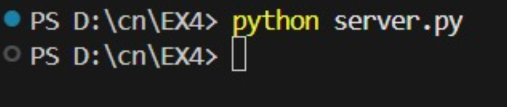

# 4.Execution_of_NetworkCommands
## AIM :Use of Network commands in Real Time environment
## Software : Command Prompt And Network Protocol Analyzer
## Procedure: To do this EXPERIMENT- follows these steps:
<BR>
In this EXPERIMENT- students have to understand basic networking commands e.g cpdump, netstat, ifconfig, nslookup ,traceroute and also Capture ping and traceroute PDUs using a network protocol analyzer 
<BR>
All commands related to Network configuration which includes how to switch to privilege mode
<BR>
and normal mode and how to configure router interface and how to save this configuration to
<BR>
flash memory or permanent memory.
<BR>
This commands includes
<BR>
• Configuring the Router commands
<BR>
• General Commands to configure network
<BR>
• Privileged Mode commands of a router 
<BR>
• Router Processes & Statistics
<BR>
• IP Commands
<BR>
• Other IP Commands e.g. show ip route etc.
<BR>

## PROGRAM 

```
CLIENT.py
import socket

c = socket.socket()
c.connect(("localhost", 5000))

host = input("Enter website/IP: ")
c.send(host.encode())

print(c.recv(4096).decode())

c.close()

SERVER.py

import socket, subprocess

s = socket.socket()
s.bind(("localhost", 5000))
s.listen(1)

c, addr = s.accept()
host = c.recv(1024).decode()

result = subprocess.getoutput("ping " + host)
c.send(result.encode())

c.close()

Trace.py

import subprocess

target = input("Enter website or IP: ")

subprocess.run(["tracert", target])
```


## Output
```
ping command 
```




```
tracert
```


```
netstat
```


```
ipconfig
```


```
nslookup
```


```
arp
```


```
systeminfo
```

## Result
Thus Execution of Network commands Performed 
